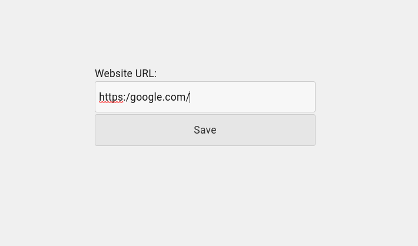
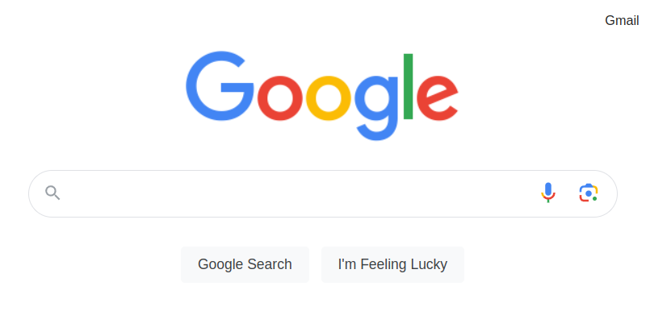

<!-- New tab redirect readme v.1.0.2 -->

# New tab redirect
## Summary:  
Any website in a new tab. This add-on automatically opens your website every time you open a new tab in your browser. (Custom Start Page).  

## Description:
To set up your website URL to open in a new tab whenever you create one, you need to enter the URL address in the add-on options. Once you've done that, simply press the "+" button to create a new tab (or use the Ctrl+T shortcut) and your website will open automatically.  

## Screenshots:

