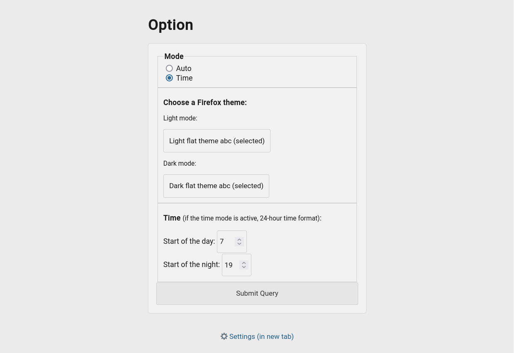

# Auto theme switcher
Automatically change the browser theme based on the operating system's light or dark color scheme or depending on time. 

Note: Auto mode works unstably with certain theme settings in the extension and with some themes.

