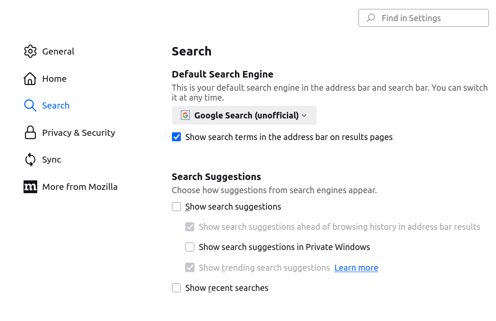

# Google search (unofficial)

URL www.google.com/search?q={searchTerms} as Search engine. (unofficial)
  
## Description:
This extension was created to see the URL address when searching.  
  
## Screenshot:

