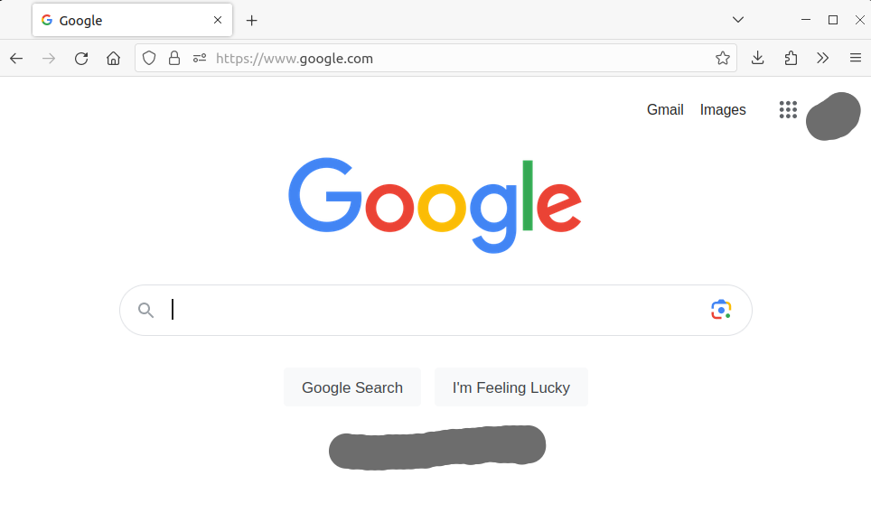

# New tab redirect

Any website in a new tab. This add-on automatically opens your website every time you open a new tab in your browser.
  
## Description:
To set up your website URL to open in a new tab whenever you create one, you need to enter the URL address in the add-on options. Once you've done that, simply press the "+" button to create a new tab (or use the Ctrl+T shortcut) and your website will open automatically.  
  
## How the addon works:  
1. When you open a new tab, the addon page opens.  
2. The addon redirects to the page specified in the settings (it creates a new tab and closes itself; it's fast).  
3. Done; you should theoretically be on your page.  

## Keywords:
New Tab Redirect, Custom New Tab,
  
## Screenshots:

