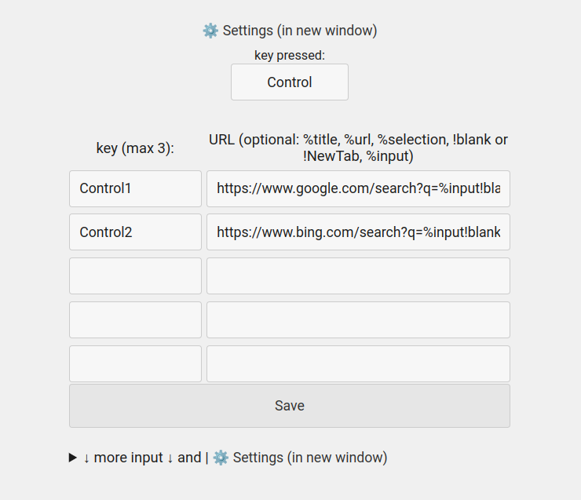

README.md  

About:  
Assign key to a specific website.  
Pressing the key will open the site. In the settings, you need to specify: key = URL address of the site..  

Notice:  
· Keys: maximum 1-3 keys.  
· Optional parameter for URL:  
%title (page title),  
%url (page URL),  
%selection (selected text on a page),  
%input (input dialog).  
· Addon tries to stop working when entering text.

Example:  
key and URL:  
"!" and "https://twitter.com/"   
"Control1" and "https://google.com/?q=%input"  

Screenshots:  

