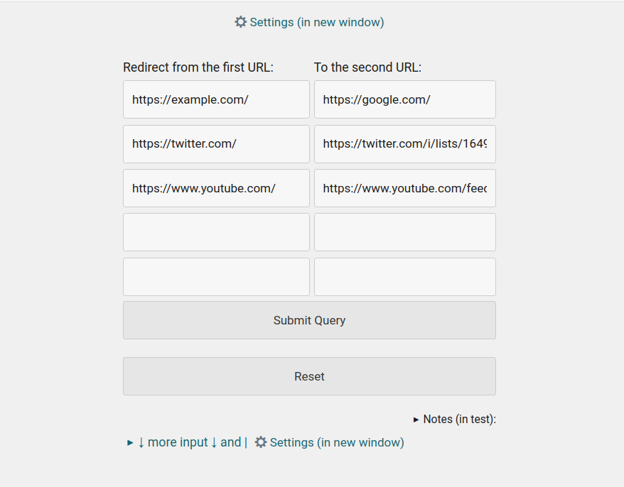

README.md  

About:  

This add-on redirects from one URL to another  

Redirection from one URL address to another. In the settings, specify two URLs, URL 1 => URL 2, URL 1 redirects to URL 2

+
You can use this "*" symbol in the first URL. (test)

Screenshots:  

