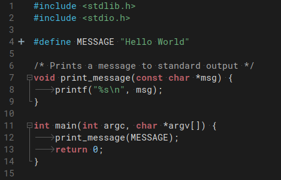

README.md
###
# Geany Color Schemes

# Light Color
#### Screenshot Gnome

### [abc-light.conf](abc-light.conf)

# Dark Color
#### Screenshot Gnome

### [abc-dark.conf](abc-dark.conf)

## put theme-name.conf in ~/.config/geany/colorschemes/

