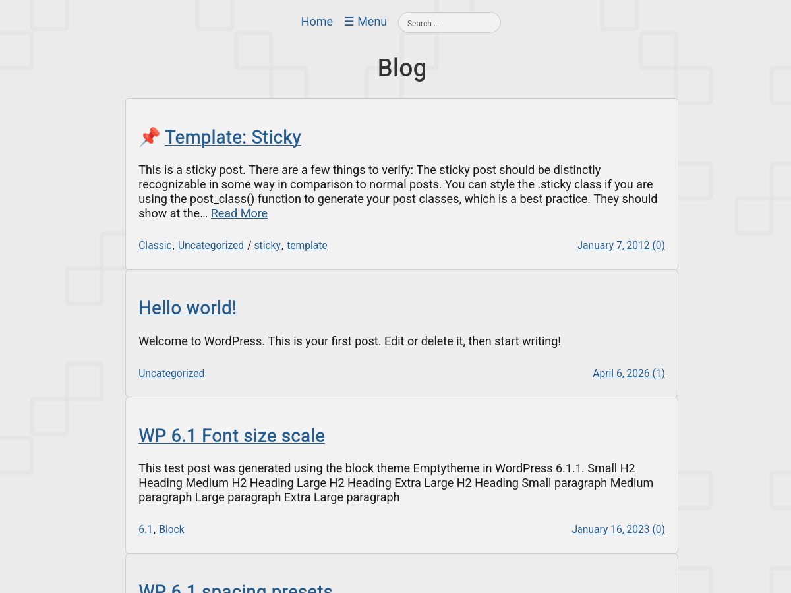

# simplehomepage

Description: An experimental, lightweight WordPress theme. It features a clean, flat, and minimalist design with a bright, light color palette. You can use it to create a blog, personal site, or microblog. (Note: Supports only a single-level navigation menu. Background with a random picture.)  
  
---
    
## Screenshot:

