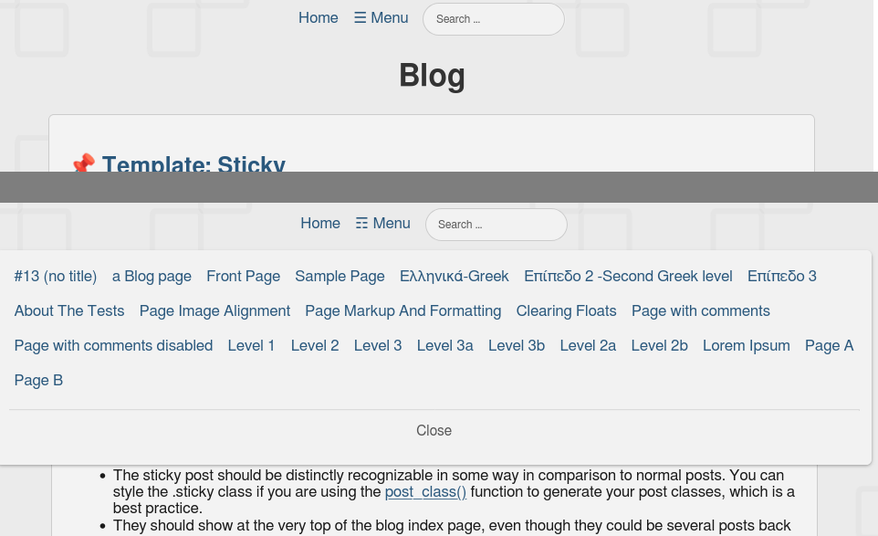

# Navigation menu

## Screenshot:
  

## Navigation consists of several parts:

- HTML navigation code in the index.html file.
- CSS navigation code in the style.css file.
- JS navigation code in the script.js file
- Noscript CSS version of the navigation when JavaScript is disabled in the file noscript.css, which is specified in the header of the page file: index.html

## Needs edits:

- JS config. In the JS file or in the script, you need to specify the width of your "wrapper" in pixels from your CSS file.
- CSS changes required. Navigation uses main.css and auto.css (colors) of this site.

