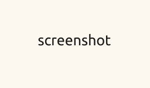

README.md

<!-- comment -->

<!-- https://docs.github.com/en/get-started/writing-on-github/getting-started-with-writing-and-formatting-on-github/basic-writing-and-formatting-syntax
-->
text 
# text
## text
### text
#### text
##### text
###### text


- list
 - list
  - list


[example.com](http://example.com/)

<!-- code -->
```javascript
let a = "Hello World!";
console.log(a);
alert(a);
```

#### Screenshots:



